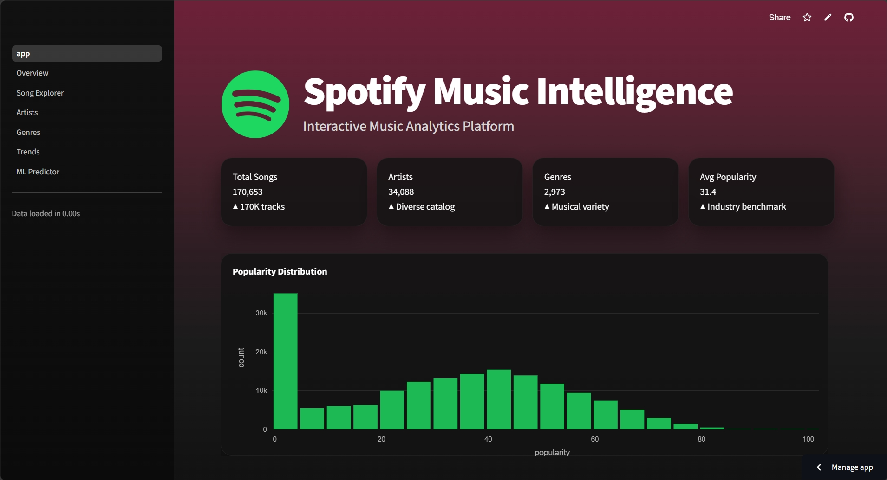

# 🎵 Spotify Music Intelligence

**End-to-End Machine Learning Analytics Platform for Spotify Music Data**


**[🌐 Live Demo](https://spotify-analyse.streamlit.app/)**



---

## Overview

Spotify Music Intelligence is an end-to-end data science platform that turns raw Spotify track data into actionable insights. It combines exploratory data analysis, predictive modeling, explainable AI, and an interactive Streamlit dashboard.

**Use cases:**
- Discover audio characteristics and patterns in modern music
- Analyze artist and genre performance over time
- Predict song popularity before release
- Understand which features drive commercial success

## Highlights

- ✅ End-to-end ML pipeline, from raw data to deployment
- ✅ Hyperparameter-tuned Random Forest model (R² = 0.809)
- ✅ SHAP explainability for transparent predictions
- ✅ 7-page interactive Streamlit dashboard
- ✅ Automated testing via GitHub Actions
- ✅ Live cloud deployment

## 📊 Project at a Glance

| Metric | Value |
|---|---:|
| Songs | 170,000+ |
| Artists | 34,000+ |
| Dashboard Pages | 7 |
| ML Models Compared | 3 |
| Best R² Score | 0.809 |

## Dataset

**170,000+ tracks**, **34,000+ artists** from Spotify, with audio features and metadata.

| Feature | Description |
|---|---|
| `track_name`, `artist_name`, `track_id` | Track metadata |
| `popularity` | Score 0–100 (target variable) |
| `danceability`, `energy`, `valence` | Core audio characteristics (0–1) |
| `loudness` | Overall loudness (dB) |
| `acousticness`, `instrumentalness`, `speechiness`, `liveness` | Audio texture features (0–1) |
| `tempo` | Beats per minute |
| `duration_ms`, `genre`, `year` | Track length, genre, release year |

Source: [Kaggle – Spotify Tracks Dataset](https://www.kaggle.com/datasets/maharshipandya/spotify-tracks-dataset)

## Dashboard Pages

| Page | Purpose |
|---|---|
| 🏠 Home | Dataset KPIs and navigation |
| 📊 Overview | Popularity distribution, correlation heatmap, feature stats |
| 🎵 Song Explorer | Search tracks, radar chart of features, similar songs |
| 🎤 Artist Analytics | Career trajectory, feature profiles, related artists |
| 🎵 Genre Analytics | Genre comparison, distribution, evolution over time |
| 📈 Trends | Feature evolution from the 1960s to present |
| 🤖 Popularity Predictor | Real-time prediction with SHAP explanation |

## Machine Learning

Models evaluated:

- Linear Regression
- Decision Tree Regressor
- Random Forest Regressor

| Model | MAE | RMSE | R² |
|---|---|---|---|
| Linear Regression | 7.98 | 10.73 | 0.759 |
| Decision Tree | 9.22 | 13.67 | 0.609 |
| **Random Forest** | **6.75** | **9.55** | **0.809** |

**Random Forest** was selected as the final model — best accuracy across all metrics, robust to non-linearity, and interpretable via feature importance. Hyperparameter tuning was performed using `GridSearchCV` to optimize the Random Forest model.

### Explainable AI

The Random Forest feature importance analysis identified danceability, energy, loudness, valence, and acousticness as some of the most influential features used to predict song popularity. SHAP analysis was used to further explain both global feature importance and individual predictions.

## Pipeline

```
Spotify Dataset
      │
      ▼
Data Cleaning
      │
      ▼
Exploratory Data Analysis
      │
      ▼
Feature Engineering
      │
      ▼
Machine Learning
      │
      ▼
Hyperparameter Tuning
      │
      ▼
Explainable AI (SHAP)
      │
      ▼
Streamlit Dashboard
      │
      ▼
Live Deployment
```

## Project Structure

```
spotify-analyse/
├── .github/workflows/ci.yml      # CI pipeline (tests + linting)
├── dashboard/                    # Streamlit app (app.py, pages/, components/)
├── data/                         # raw / processed / external datasets
├── models/                       # trained model, scaler, metadata
├── notebooks/                    # EDA, feature engineering, training, SHAP
├── src/                          # data, features, models, utils modules
├── tests/                        # unit tests
├── requirements.txt
└── README.md
```

## Installation

```bash
git clone https://github.com/acelin009/spotify-analyse.git
cd spotify-analyse

python -m venv venv
source venv/bin/activate      # Windows: venv\Scripts\activate

pip install -r requirements.txt
```

## Running Locally

```bash
# Launch dashboard
cd dashboard
streamlit run app.py          # opens at http://localhost:8501

# Train model
python src/models/train.py

# Run tests
pytest tests/ --cov=src
```

## Model Performance

| Metric | Value |
|---|---|
| R² Score | 0.809 |
| MAE | 6.75 |
| RMSE | 9.55 |

## CI/CD

GitHub Actions automatically validates the project by installing dependencies and running the automated test suite on every push and pull request.

## Tech Stack

**Data & ML:** Pandas, NumPy, Scikit-learn, SHAP
**Visualization:** Plotly, Matplotlib, Seaborn
**Dashboard:** Streamlit
**DevOps:** GitHub Actions, Pytest, Flake8

## Deployment

Deployed via [Streamlit Cloud](https://share.streamlit.io) from the `dashboard/app.py` entry point.

## Roadmap

- Spotify API integration for real-time data
- Recommendation engine for similar songs
- Deep learning models for improved prediction
- REST API for programmatic access
- Mobile companion app

## License

Licensed under the [MIT License](LICENSE).

## Author

**Acelin Nazareth** — Data Science Student

[GitHub](https://github.com/acelin009) · [LinkedIn](https://linkedin.com/in/acelin.nazareth) · [Email](mailto:acelin.nazareth@email.com)

---

⭐ If you find this project useful, consider starring the repo.
