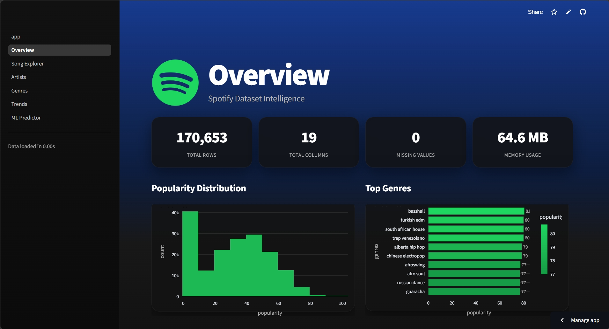
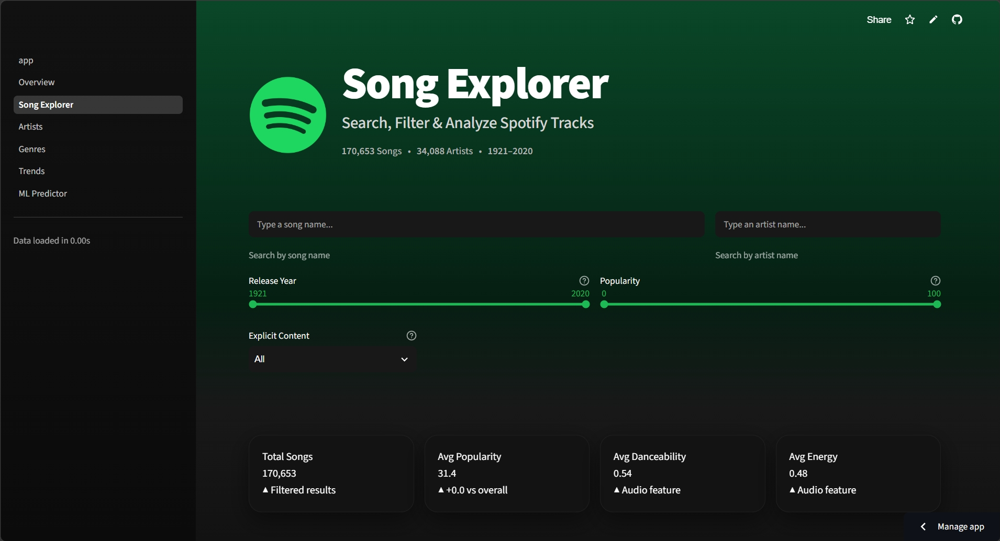
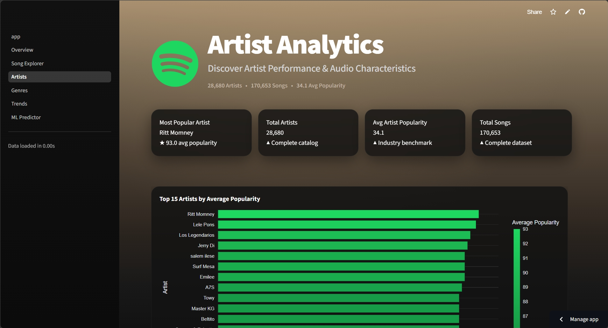
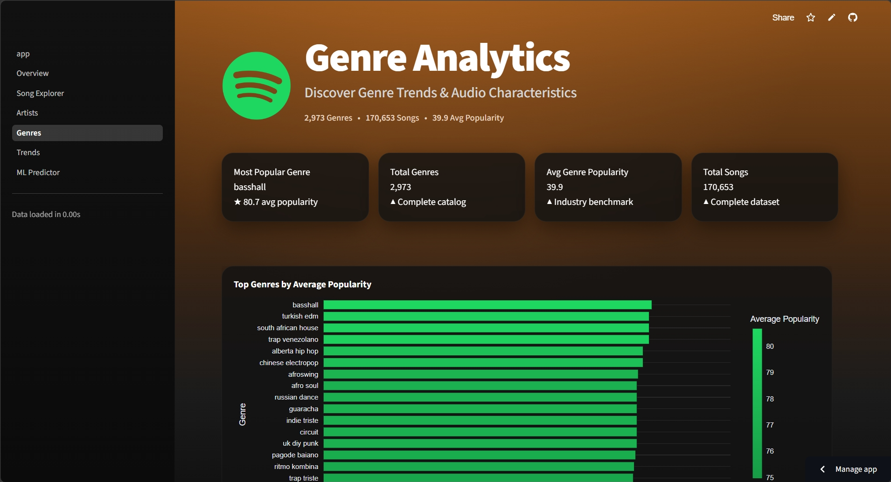
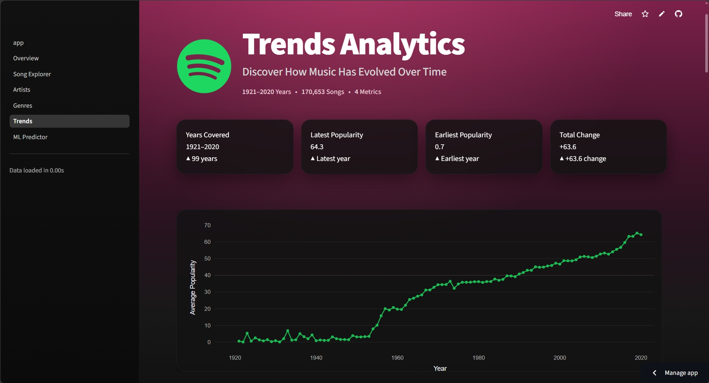
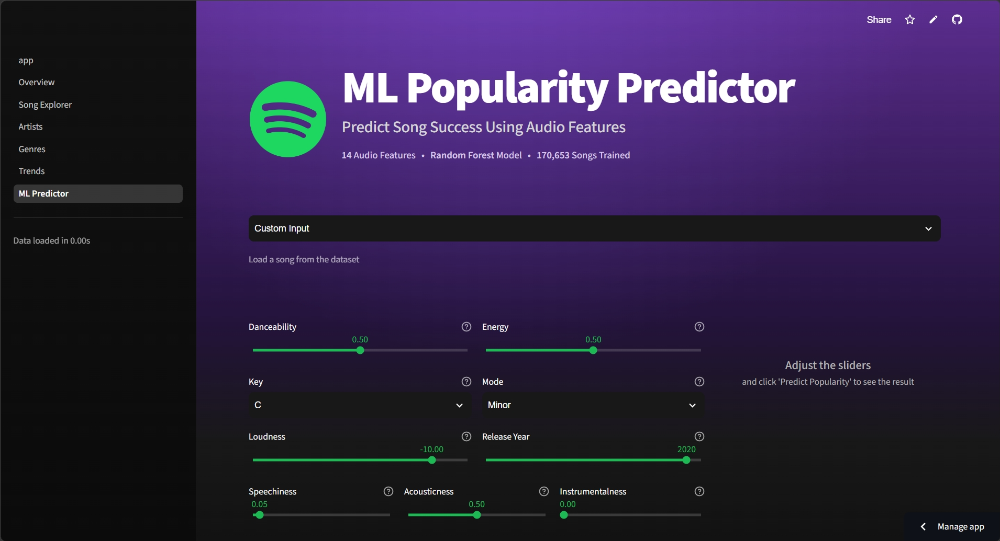

# 🎵 Spotify Music Intelligence

**End-to-End Machine Learning Analytics Platform for Spotify Music Data**


**[🌐 Live Demo](https://spotify-analyse.streamlit.app/)**


---

## Overview

**Spotify Music Intelligence** is an end-to-end data science and machine learning platform built to analyze over **170,000 Spotify songs** using exploratory data analysis, predictive modeling, and interactive dashboards. The project demonstrates the complete lifecycle of a production-inspired ML solution — from raw data exploration and feature engineering to deployment on Streamlit Cloud.

**Use cases:**
- Discover audio characteristics and patterns in modern music
- Analyze artist and genre performance over time
- Predict song popularity before release
- Understand which features drive commercial success

## Highlights

- ✅ End-to-end ML pipeline, from raw data to deployment
- ✅ Hyperparameter-tuned Random Forest model (R² = 0.809)
- ✅ Feature importance analysis for model transparency
- ✅ 7-page interactive Streamlit dashboard
- ✅ Automated testing via GitHub Actions
- ✅ Live cloud deployment

## 📊 Project at a Glance

| Metric | Value |
|---|---:|
| Songs Analyzed | **170,653** |
| Artists | **34,088** |
| Genres | **2,973** |
| Audio Features Used for ML | **14** |
| Dashboard Pages | **7** |
| ML Models Compared | **3** |
| Best Model | **Random Forest Regressor** |
| Best R² Score | **0.809** |

## Dataset

The project is built using Spotify datasets containing **170,653 songs**, **34,088 artists**, **2,973 genres**, and yearly aggregated statistics.

The primary dataset contains **19 columns** describing each track's metadata and audio characteristics, used for exploratory analysis and machine learning.

### 📂 Datasets Used

| Dataset | Purpose |
|---|---|
| `data.csv` | Main song-level dataset used for EDA and machine learning |
| `data_by_artist.csv` | Artist-level aggregated statistics |
| `data_by_genres.csv` | Genre-level aggregated audio features |
| `data_by_year.csv` | Year-wise music trends |
| `data_w_genres.csv` | Songs enriched with genre information |

### Main Dataset Features

| Feature | Description |
|---|---|
| `name` | Song title |
| `artists` | Artist(s) performing the song |
| `release_date` | Song release date |
| `year` | Release year |
| `popularity` | Spotify popularity score (0–100) *(target variable)* |
| `danceability` | Suitability for dancing (0–1) |
| `energy` | Perceived intensity and activity (0–1) |
| `valence` | Musical positivity or happiness (0–1) |
| `tempo` | Beats per minute (BPM) |
| `loudness` | Overall loudness (dB) |
| `speechiness` | Presence of spoken words |
| `acousticness` | Likelihood of being acoustic |
| `instrumentalness` | Probability of containing no vocals |
| `liveness` | Presence of a live audience |
| `duration_ms` | Song duration in milliseconds |
| `key` | Musical key |
| `mode` | Major or minor scale |
| `explicit` | Explicit lyrics indicator |
| `id` | Spotify Track ID |

Source: [Kaggle – Spotify Tracks Dataset](https://www.kaggle.com/datasets/maharshipandya/spotify-tracks-dataset)

---

## 🖥️ Dashboard Pages

### 🏠 Overview



**Purpose:** Landing page giving a high-level snapshot of the full dataset.

**Features:**
- Quick stats — total rows, columns, missing values, and memory usage
- Popularity distribution histogram
- Top 10 genres by average popularity
- Interactive preview of the raw dataset with progress-bar formatting for popularity

---

### 🎵 Song Explorer



**Purpose:** Search, filter, and analyze individual tracks.

**Features:**
- Search by song name or artist, with year, popularity, and explicit-content filters
- Live summary metrics (total songs, average popularity, danceability, energy) for the filtered selection
- Popularity distribution with KDE overlay and mean marker
- Danceability vs. energy scatter plot colored by popularity
- Filterable, sortable data table (up to 1,000 rows)
- CSV export of the filtered results

---

### 🎤 Artist Analytics



**Purpose:** Analyze and compare artist performance.

**Features:**
- Top 15 artists by average popularity
- Side-by-side comparison of two artists with a radar chart of audio features
- Automated summary of each artist's relative strengths
- Popularity distribution across artists with key insights

---

### 🎼 Genre Analytics



**Purpose:** Compare and explore music genres.

**Features:**
- Top 20 genres by average popularity
- Side-by-side genre comparison with audio feature breakdown and summary
- Heatmap of audio features across genres
- Genre-level energy vs. popularity scatter plot
- Genre explorer table with CSV export

---

### 📈 Trends



**Purpose:** Explore how music has evolved over time.

**Features:**
- Year-over-year trend charts for selected audio features
- Rolling averages to smooth out yearly noise
- Year-over-year percentage change view
- Combined multi-feature trend comparison
- Key insights summary (e.g. loudness and energy shifts over the decades)

---

### 🤖 Popularity Predictor



**Purpose:** Predict a song's popularity from its audio features using the trained Random Forest model.

**Features:**
- Load a real example song as a starting point, or set all 14 audio features manually via sliders and dropdowns
- Real-time popularity prediction with a gauge chart and confidence indicator
- Song profile summary showing how each feature compares to typical ranges
- Key insights explaining what's driving the predicted score

---

## Machine Learning

Models evaluated:

- Linear Regression
- Decision Tree Regressor
- Random Forest Regressor

| Model | MAE | RMSE | R² |
|---|---|---|---|
| Linear Regression | 7.98 | 10.73 | 0.759 |
| Decision Tree | 9.22 | 13.67 | 0.609 |
| **Random Forest** | **6.75** | **9.55** | **0.809** |

**Random Forest** was selected as the final model — best accuracy across all metrics, robust to non-linearity, and interpretable via feature importance. Hyperparameter tuning was performed using `GridSearchCV` to optimize the Random Forest model.

### Feature Importance

The Random Forest feature importance analysis identified danceability, energy, loudness, valence, and acousticness as some of the most influential features used to predict song popularity.

## Pipeline

```
Spotify Dataset
      │
      ▼
Data Cleaning
      │
      ▼
Exploratory Data Analysis
      │
      ▼
Feature Engineering
      │
      ▼
Machine Learning
      │
      ▼
Hyperparameter Tuning
      │
      ▼
Streamlit Dashboard
      │
      ▼
Live Deployment
```

## Project Structure

```
spotify-analyse/
├── .github/workflows/ci.yml      # CI pipeline (tests + linting)
├── dashboard/                    # Streamlit app (app.py, pages/, components/)
├── data/                         # raw / processed / external datasets
├── models/                       # trained model, scaler, metadata
├── notebooks/                    # EDA, feature engineering, training
├── src/                          # data, features, models, utils modules
├── tests/                        # unit tests
├── requirements.txt
└── README.md
```

## Installation

```bash
git clone https://github.com/acelin009/spotify-analyse.git
cd spotify-analyse

python -m venv venv
source venv/bin/activate      # Windows: venv\Scripts\activate

pip install -r requirements.txt
```

## Running Locally

```bash
# Launch dashboard
cd dashboard
streamlit run app.py          # opens at http://localhost:8501

# Train model
python src/models/train.py

# Run tests
pytest tests/ --cov=src
```

## Model Performance

| Metric | Value |
|---|---|
| R² Score | 0.809 |
| MAE | 6.75 |
| RMSE | 9.55 |

## CI/CD

GitHub Actions automatically validates the project by installing dependencies and running the automated test suite on every push and pull request.

## Tech Stack

**Data & ML:** Pandas, NumPy, Scikit-learn
**Visualization:** Plotly, Matplotlib, Seaborn
**Dashboard:** Streamlit
**DevOps:** GitHub Actions, Pytest, Flake8

## Deployment

Deployed via [Streamlit Cloud](https://share.streamlit.io) from the `dashboard/app.py` entry point.

## Roadmap

- Spotify API integration for real-time data
- Recommendation engine for similar songs
- Deep learning models for improved prediction
- REST API for programmatic access
- Mobile companion app

## License

Licensed under the [MIT License](LICENSE).

## Author

**Acelin Nazareth** — Data Science Student

[GitHub](https://github.com/acelin009) · [LinkedIn](https://www.linkedin.com/in/acelin-nazareth-a7666a281/) · [Email](mailto:acelin.nazareth@email.com)

---

⭐ If you find this project useful, consider starring the repo.
