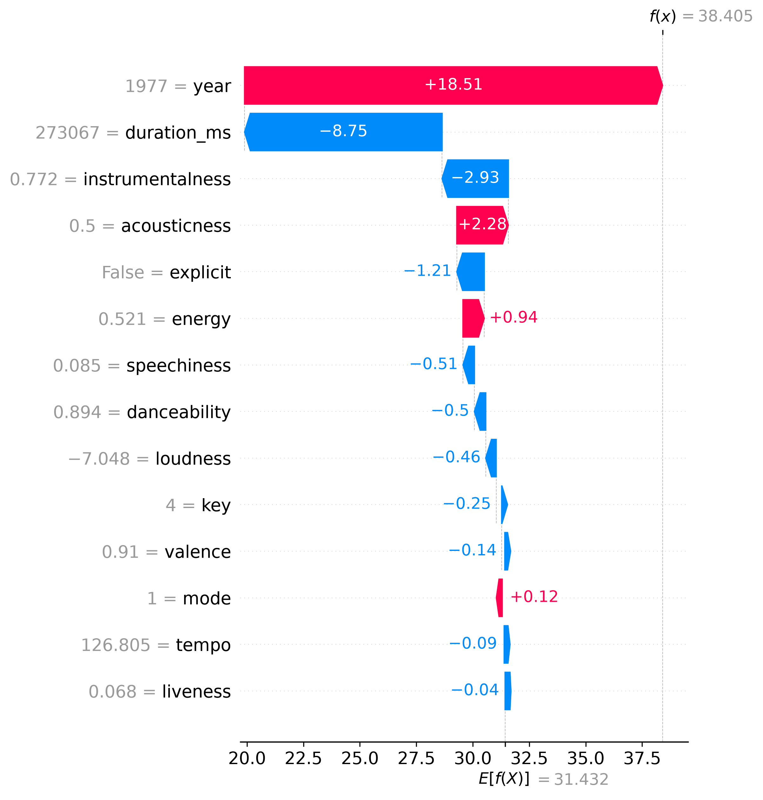
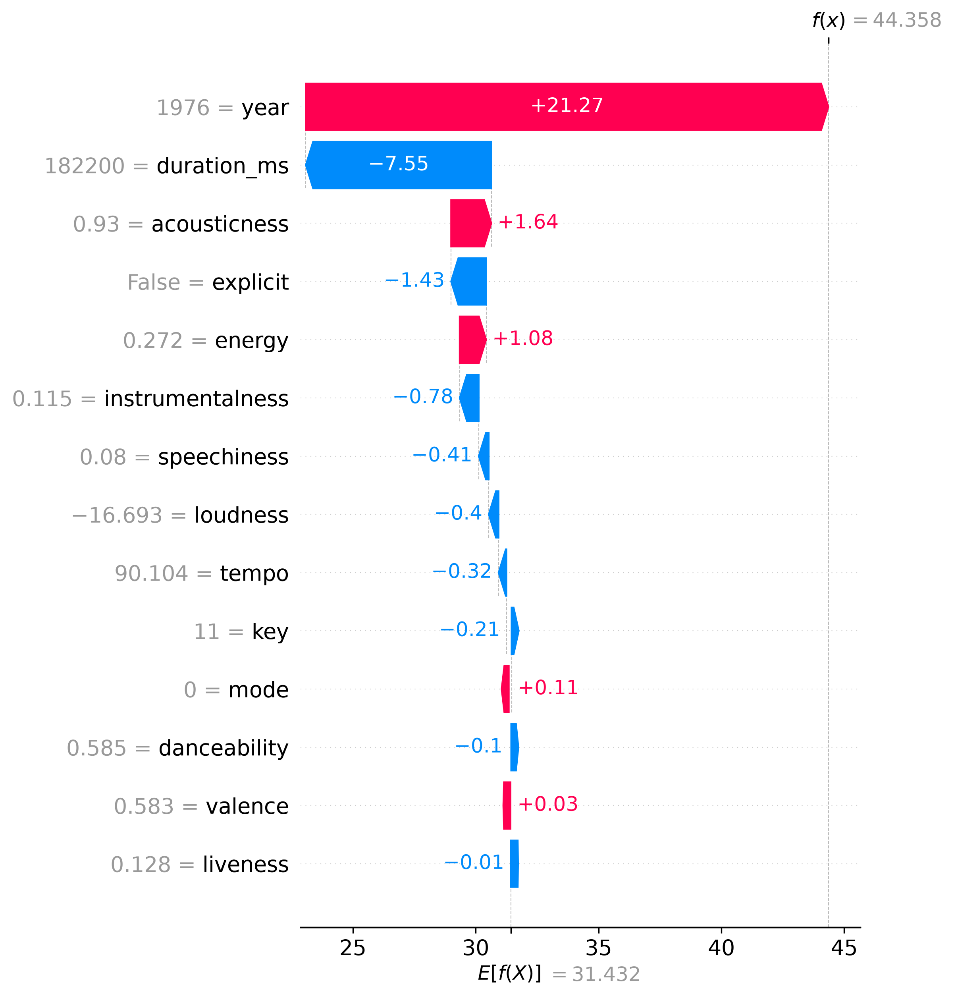
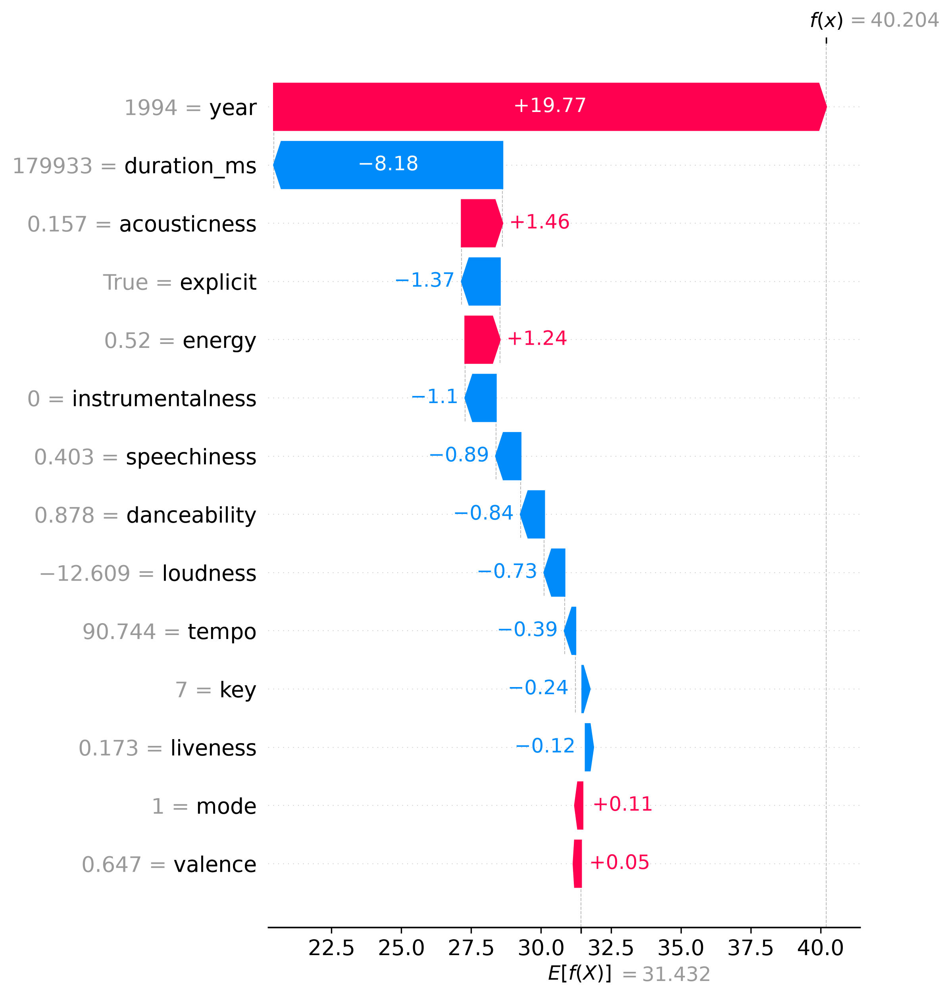
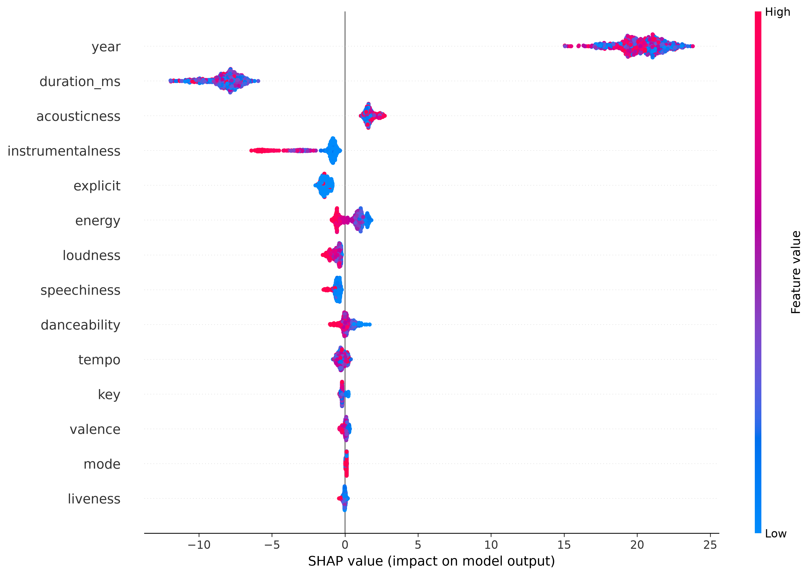
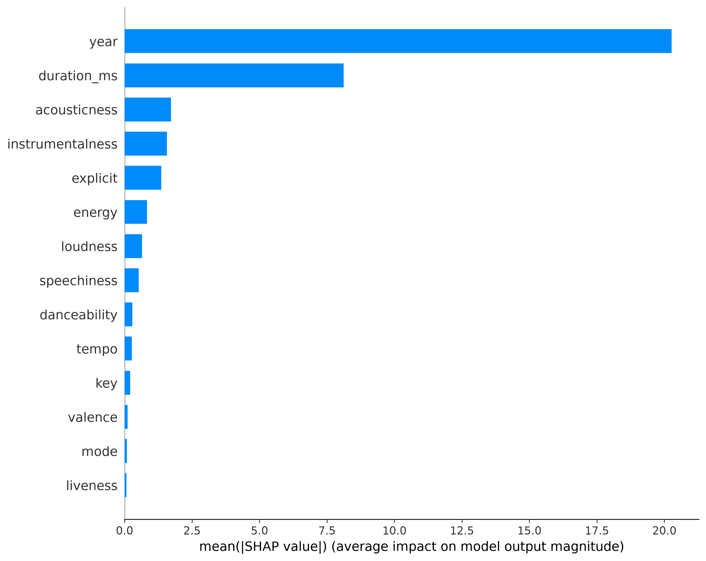
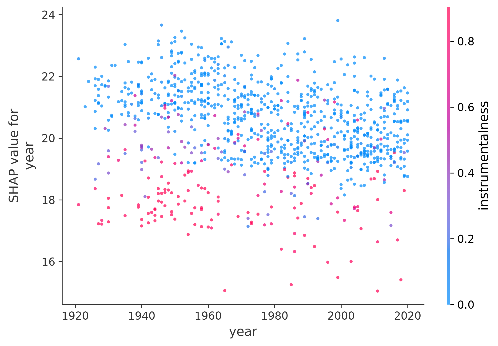
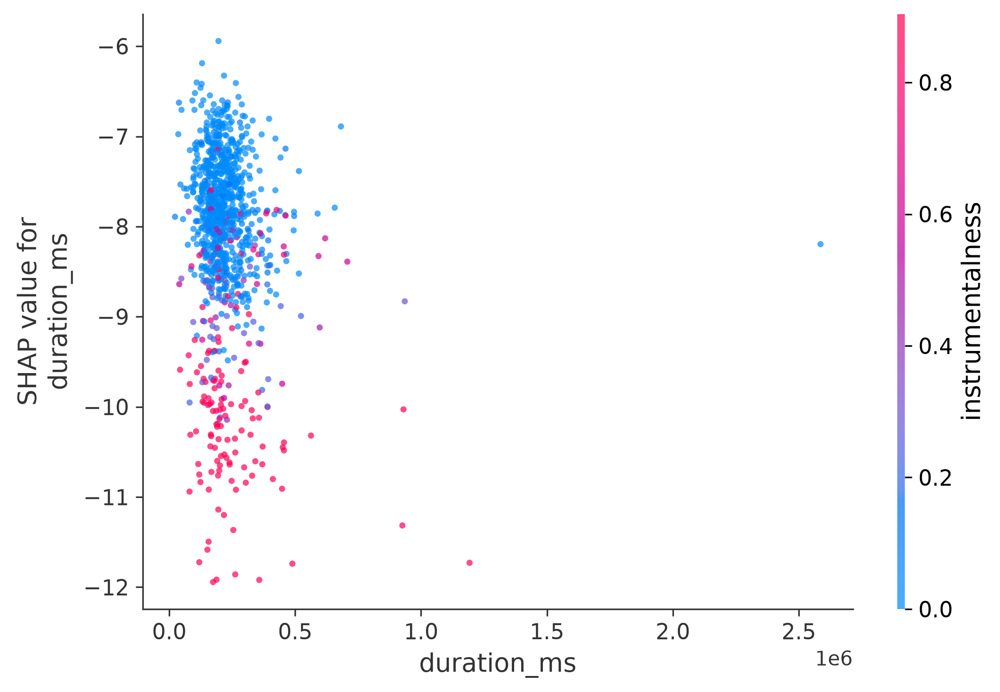
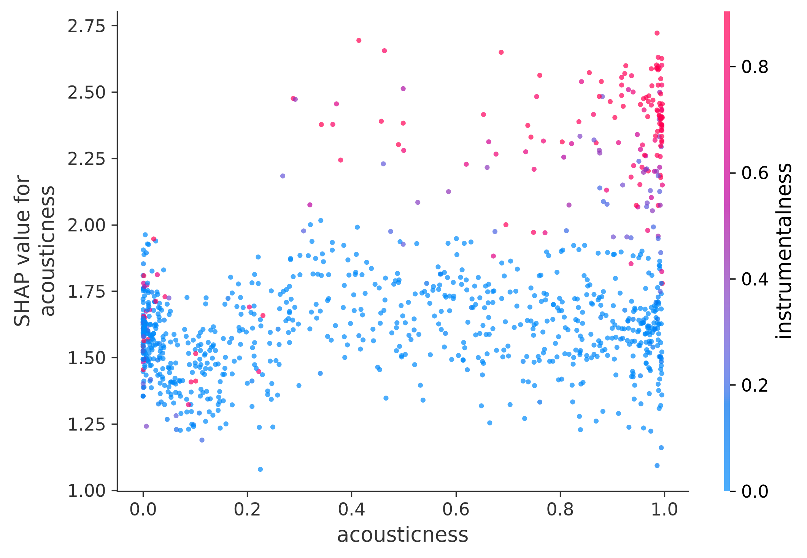

# Spotify Popularity Prediction - SHAP Explanation Report

**Generated:** 2026-07-10 13:27:54

## Overview

- **Model Type:** Random Forest Regressor
- **Number of Features:** 14
- **Number of Samples Explained:** 1000
- **SHAP Method:** TreeExplainer (exact)

## Top 10 Most Influential Features

| Rank | Feature | Mean SHAP | Percentage |
|------|---------|-----------|------------|
| 14 | year | 20.265 | 56.2% |
| 12 | duration_ms | 8.117 | 22.5% |
| 7 | acousticness | 1.721 | 4.8% |
| 8 | instrumentalness | 1.574 | 4.4% |
| 13 | explicit | 1.360 | 3.8% |
| 2 | energy | 0.833 | 2.3% |
| 4 | loudness | 0.649 | 1.8% |
| 6 | speechiness | 0.525 | 1.5% |
| 1 | danceability | 0.287 | 0.8% |
| 11 | tempo | 0.275 | 0.8% |

## Interpretation

### How to Read the SHAP Summary Plot

1. **Features are ordered by importance** (top = most influential)
2. **Color represents feature value** (red = high, blue = low)
3. **Position on x-axis shows impact on prediction**:
   - Positive SHAP value = pushes prediction higher
   - Negative SHAP value = pushes prediction lower

### Key Observations

1. **year** is the most influential feature
2. **duration_ms** and **acousticness** are also significant
3. Some features show non-linear relationships (visible in dependence plots)

## Individual Prediction Explanations

The following waterfall plots show how features contributed to specific predictions:

### Sample 0

### Sample 1

### Sample 2

## Visualization Gallery

### 1. SHAP Summary Plot (Beeswarm)

*This plot shows global feature importance and direction of impact.*

### 2. SHAP Bar Plot

*This plot ranks features by average absolute SHAP value.*

### 3. Feature Dependence Plots

These plots show how individual features affect predictions:

#### year

#### duration_ms

#### acousticness

## Recommendations

Based on the SHAP analysis:

1. **Focus on top features** for model improvement and feature engineering
2. **Investigate non-linear relationships** shown in dependence plots
3. **Consider feature interactions** between top features
4. **Use individual explanations** for business decisions and stakeholder communication

---
*Report generated by Spotify Popularity Prediction Pipeline*
